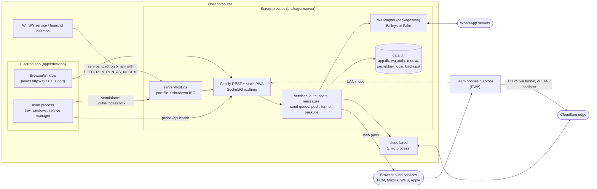
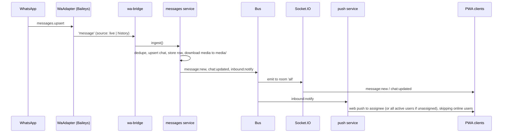

# Architecture

EzyChat Lite is a single-tenant system: one computer, one WhatsApp number, one SQLite database.
A Node server owns all state; the Electron app supervises it; browsers (desktop window, phones,
laptops) are thin clients over REST + Socket.IO. The full design rationale is in
[`docs/superpowers/specs/2026-10-02-whatsapp-team-inbox-design.md`](superpowers/specs/2026-10-02-whatsapp-team-inbox-design.md).

## Processes



- **Standalone mode:** the desktop main process forks `server-host.cjs`, which loads the bundled
  `server.cjs`, writes the effective port to `WATI_PORT_FILE`, and closes gracefully on a `shutdown`
  IPC message. The server lives only while the app runs (closing the window hides it to the tray).
  Data: `<userData>/data`.
- **Service mode:** WinSW (Windows, LocalSystem) or a launchd daemon
  (`/Library/LaunchDaemons/org.ossmalaysia.wateaminbox.server.plist`) runs the same host with the
  Electron binary as Node (`ELECTRON_RUN_AS_NODE=1`). Data moves to `C:\ProgramData\wa-team-inbox`
  or `/Library/Application Support/wa-team-inbox`. The desktop app detects the running server and
  becomes a client window; it never starts a second server while the service is installed.
- **One server per data dir:** a lock file in the data dir; a second instance exits with code 3.
- **cloudflared** is a child of the server, so the tunnel works the same in both modes and is
  restored on restart.

## Server internals

- `main.ts#startServer`: acquire lock → logger → `createContext` (db, `SecretBox`, settings, `Bus`,
  `WaAdapter`) → initializers from `services.ts` (auth, tunnel, admin + backups, messaging, push) →
  `buildApp` (Host hook, Origin hook, security headers, routes under `/api`, static PWA with SPA
  fallback) → listen → attach Socket.IO → `wa.connect()`.
- `Bus` (`bus.ts`) is the only way services announce changes. Listeners are isolated: one failing
  listener is logged and does not affect others.
- `realtime/socket.ts` authenticates sockets with the session cookie (plus an Origin check) and
  joins them to `all`, `user:<id>`, and `admins` for admins. Role changes and revoked sessions are
  applied to live sockets.

## Data flow: inbound message



History sync uses the same path with `source: 'history'` (limited by the `history_days` setting) and
does not notify. Delivery/read acks arrive as `messageStatus` events and become `message:status`.

## Data flow: outbound send

```mermaid
sequenceDiagram
  participant UI as PWA
  participant API as POST /api/chats/:jid/messages (or /media)
  participant Ms as messages service
  participant Q as SendQueue
  participant Ad as WaAdapter
  participant Bus

  UI->>API: { clientId, text, quotedId? }
  API->>Ms: create pending row (local-<clientId>)
  Ms->>Bus: message:new (status pending)
  Ms->>Q: enqueue job
  Q->>Q: per-chat FIFO, wait while disconnected, >=1s spacing, expire after 10 min
  Q->>Ad: sendPresence(composing), sendText / sendMedia
  Ad-->>Q: SendResult (WhatsApp id)
  Q->>Ms: onSent: rename local id -> WA id, status sent
  Ms->>Bus: message:status
  Note over Q,Ms: errors: wa_unavailable keeps the job pending; others mark it failed (retry via POST /api/messages/:id/retry)
```

Pending jobs are persisted in the database and re-enqueued on startup.

## Module boundaries

| Module            | May depend on                                                       | Must not                                                         |
| ----------------- | ------------------------------------------------------------------- | ---------------------------------------------------------------- |
| `packages/shared` | zod only                                                            | import anything from other workspaces                            |
| `packages/wa`     | `shared`; `baileys` **only** inside `src/baileys/**`                | touch the database or HTTP                                       |
| `packages/server` | `shared`, `wa` (interface + `FakeWaAdapter`; Baileys loaded lazily) | import Electron or web code                                      |
| `apps/web`        | `shared` (types + schemas)                                          | import server or wa code; call anything but `/api` and Socket.IO |
| `apps/desktop`    | Electron, the bundled server as a separate process                  | import server modules in the main process                        |

Rules that cut across modules:

- **API contract:** every REST body/response and socket payload is a zod schema in
  `packages/shared`. Server routes `parse()` with it; the web app uses the same types.
- **Fake WhatsApp:** `FakeWaAdapter` backs unit tests, `npm run dev` and Playwright e2e. Only with
  `--fake-wa` does the server register `POST /api/dev/fake-incoming`. Fake mode is never allowed in
  service mode.
- **Security boundaries** live in `packages/server/src/http/` (Host allowlist, Origin check, client IP
  and tunnel detection, security headers) and `routes/setup.ts` / `routes/media.ts`. See the
  invariants list in [`CLAUDE.md`](../CLAUDE.md).
- **UI:** shadcn/ui primitives and Calm Desk tokens per [`design-system.md`](design-system.md).
